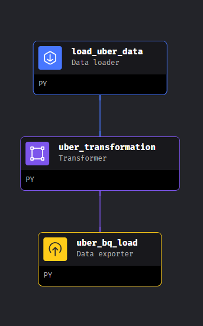

# Uber-Data-Engineering-Project

This end-to-end data engineering project involves extracting data from the Uber Dataset from GCP Cloud Storage, performing an ETL (Extract, Transform, Load) process using Mage Data pipeline tool on GCP VM instance, and ultimately storing the transformed data in an BigQuery Datawarehouse. This project demonstrates the full data pipeline, from data acquisition to storage, making it a comprehensive data engineering solution.

## Services Used

- **GCP Cloud Storage :** Provides secure, reliable data storage for Uber datasets, ensuring accessibility throughout the analytics journey.

- **Python :** Empowers data manipulation, analysis, and seamless integration, enabling efficient handling of Uber's extensive dataset.

- **GCP Compute Instance :** Delivers the essential computational resources to process Uber data, meeting the demands of complex analytics tasks.

- **Mage Data Pipeline Tool :** Central to data management, it transforms and prepares Uber data, ensuring structured and efficient analysis.

- **BigQuery Data Warehouse :** Serves as a pivotal hub for scalable querying and analysis of Uber data, unveiling insights and patterns for informed decision-making.

- **Looker Studio :** Facilitates data visualization and exploration, simplifying effective communication of findings and insights to the project team and stakeholders.

## Dataset Used

TLC Trip Record Data Yellow and green taxi trip records include fields capturing pick-up and drop-off dates/times, pick-up and drop-off locations, trip distances, itemized fares, rate types, payment types, and driver-reported passenger counts.

Here is the dataset used in the video - https://github.com/darshilparmar/uber-etl-pipeline-data-engineering-project/blob/main/data/uber_data.csv

More info about dataset can be found here:

Website - https://www.nyc.gov/site/tlc/about/tlc-trip-record-data.page

Data Dictionary - https://www.nyc.gov/assets/tlc/downloads/pdf/data_dictionary_trip_records_yellow.pdf

Modern Data Pipeine Tool - https://www.mage.ai/

Contibute to this open source project - https://github.com/mage-ai/mage-ai

## Project Overflow

**Architectural Framework :** Develop the project's architectural blueprint.

**Data Modeling :** Create an Entity-Relationship Diagram to enhance data comprehension.

**Transformation Code :** Build Python scripts for data transformation.

**GCP Setup :** Create a GCP project, configure cloud storage, and set permissions.

**Compute Resources :** Generate a GCP Compute Engine VM instance.

**Mage Project Integration :** Establish SSH connection, initialize Mage, and install dependencies.

**Data Pipeline Construction :** Build a data pipeline using Mage Blocks. Integrate transformation code into the data transformation process.

  
  

**GCP Credentials :** Incorporate GCP credentials into the 'io_config.yaml' configuration file.

Utilize BigQuery for data querying and ETL tasks to prepare data for analysis, reporting, and dashboard creation.

**Dashboard Development :** Create interactive dashboards using visualization and reporting tools like Looker Studio, Power BI, Tableau, or similar alternatives.

https://github.com/Shreyas-028/Uber-Data-Engineering-Project/assets/79562771/86a1d1b6-cd24-4828-9fe6-f533748e5b87

## Conclusion

In summary, this project successfully harnessed advanced technologies and methodologies to analyze Uber's data. The workflow, from architecture design to ETL operations, illustrates the power of data analytics. By integrating Google Cloud Platform, Python, Mage, and BigQuery, we streamlined the process and gained actionable insights. The adoption of Looker Studio for data visualization and reporting enhances the project's impact, facilitating informed decision-making. This project exemplifies the potential of data-driven solutions in today's business landscape, emphasizing the importance of data for informed choices.
